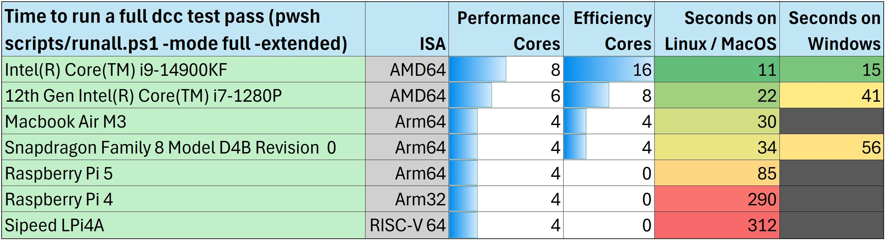
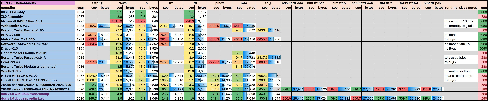

# dcc
[](https://github.com/gloveboxes/dcc/actions/workflows/ci.yml)
[](https://github.com/gloveboxes/dcc/actions/workflows/docs.yml)

C compiler targeting CP/M 2.2 on a Z80

The [dcc documentation](https://davidly.github.io/dcc/) covers all features, usage, and API reference.

## What dcc is
DCC C Compiler is an open source C compiler for CP/M 2.2 on the Z80. It supports C89 plus CP/M-relevant C99/C11 features. For every source file it accepts, dcc generates a .MAC assembly file that can be assembled by M80 and linked by L80 to produce CP/M .COM files.

A separate app dccpeep.c is a peephole optimizer that rewrites portions of .MAC files so apps run faster. It's not necessary to use dccpeep; apps will work just fine without it. But if you need your app to be both smaller and faster it's worth running.

DCCRTL.MAC is the dcc C Runtime Library. It's written in Z80 assembly for size and performance. It has the entrypoint start for apps that initializes the heap (for malloc/free) and command-line arguments so main's argc and argv work. It implements a small subset of the C89 C runtime including floating point.

dccrtlstrip.c is an app that examines the code of your .c file and strips portions of the DCCRTL.MAC C runtime so only the parts needed are linked into the .COM file. It's not necessary to run this program for your app to work. But the resulting .COM file may be smaller if you do.

The 3 compiler apps dcc, dccpeep, and dccrtlstrip all build and run on Windows, Linux, and MacOS. They are too big to run on CP/M. Use m.bat, m.sh, mmacos.sh to build these apps using msvc (Windows), gcc (Linux), or clang (MacOS) respectively. You may need to chmod 777 *.sh on Linux and MacOS prior to running dcc's scripts.

Dcc has been built and had regression tests run on AMD64 (Linux and Windows), Arm64(Linux, Windows, MacOS), Arm32 (Linux), and RISC-V 64 (Linux).

The binaries dcc produces have been tested in ntvcm (across many platforms), tnylpo (on Linux + AMD64), altair 8800 simulator (on Windows), cpm.exe (on Windows), cpmemu (on Linux), and on a physical Z80 with the Z80-MBC2 SBC. 

The Z80-MBC2 SBC has a TPA of just 55,558 bytes, significantly less than most emulators. Most of the test apps work, but some require more TPA than that. For example, running the Pascal interpreter pint.com with ttt.pas runs out of memory. But smaller test apps like e.pas work fine in pint.com.

When apps built by dcc exit back to the OS on CP/M they do so using the warm boot vector. The CCP is overwritten with the app's stack and heap, so it must be automatically reloaded by CP/M on warm boot. No attempt is made to detect RAM required by an app and preserve the CCP. Reloading the CCP generally takes a couple seconds on physical hardware.

## Documentation

Two reference documents in the [docs](docs) directory cover the runtime in depth:

  - [docs/dcc-c89-reference-guide.md](docs/dcc-c89-reference-guide.md): a practical guide to the C89 language features dcc accepts and the C runtime library implemented in DCCRTL.MAC. It documents type sizes and conventions, the recognized keywords and operators, every standard-header function that is actually linkable (stdio, stdlib, string, ctype, math, setjmp, stdarg, and the CP/M extensions), the supported printf/scanf conversions, and the limitations to keep in mind (no double, 16-bit int, integer-only `%`, etc.). Start here to learn what you can call and how.
  - [docs/dccrtlstrip-inclusion-table.md](docs/dccrtlstrip-inclusion-table.md): an internals reference explaining how dccrtlstrip decides which blocks of DCCRTL.MAC are linked into a program. It maps each C-level construct to the runtime block it pulls in and gives the transitive dependency closures and the marginal .COM size cost of each function. Use it when optimizing binary size or to understand exactly what a given call drags into the link.

## Development machine for modifying dcc
DCC is intended to be updated by app-writers to better optimize their apps. Typically a dev would point an AI at the code for their app and the code for dcc then ask the AI to profile the app and change dcc to generate better code for the app's scenario.

The inner loop of iterating on improving performance is governed by the speed of your dev machine. Running the full regression suite to ensure nothing was broken can take seconds or minuted depending on your hardware and OS choice. Not surprisingly, more cores really help. And using Linux instead of Windows (which has slower process creation times, anti-virus scanning, indexing, and more) works much better.



## Agent skills

This repo ships a project-scoped agent **skill** in [.github/skills/dcc-cpm-z80](.github/skills/dcc-cpm-z80). A skill is a folder containing a `SKILL.md` (plus optional `references/`) that packages domain knowledge — here, how to write, build, test, and debug C89/C99/C11-targeted code for dcc/CP/M/Z80 along with the runtime library inventory and hard-won pitfalls. An agent that supports skills reads `SKILL.md` on demand when your task matches the skill's description, so it gets dcc-specific guidance without you pasting it into every prompt.

### Invoking a skill in VS Code

With GitHub Copilot in VS Code (agent mode), the skill is picked up automatically when you open this repo — the agent loads it when your request falls within the skill's scope (anything mentioning dcc, CP/M, Z80, ntvcm, DCCRTL, etc.). You don't have to do anything special; you can also nudge it explicitly, e.g. "use the dcc-cpm-z80 skill to build and test foo.c".

### Using the skill from the GitHub Copilot CLI

The GitHub Copilot CLI discovers skills the same way: project skills from the repo you launch it in, plus any personal skills in your home-directory roots (see below). From the repo root just start a session and describe your task —

```sh
copilot
```

then, at the prompt, ask something within the skill's scope (e.g. "build and run tests/sieve.c for CP/M with dcc"). The CLI reads the matching `SKILL.md` on demand, exactly like VS Code. To make it available outside this repo, copy the skill into a personal skills root as shown next.

### Making the skill available system-wide

The copy in this repo only applies while you're working inside this repo. The main reason to deploy it system-wide is to build CP/M apps in a **separate, independent project**: with the skill in a personal root, the agent brings dcc-specific knowledge into that other workspace, and as long as the `dcc`/`dccpeep`/`dccrtlstrip` binaries and `DCCRTL.MAC` are on your `PATH` (see [Setting up your environment](#setting-up-your-environment)), you can compile and run from there without copying the toolchain into every project.

To use it from **every** workspace on your machine, copy the skill folder into a personal skills root in your home directory (`~/.agents/skills/`, `~/.copilot/skills/`, or `~/.claude/skills/` — pick one and stay consistent):

**macOS / Linux:**
```sh
mkdir -p ~/.agents/skills
cp -R .github/skills/dcc-cpm-z80 ~/.agents/skills/
```

**Windows (PowerShell):**
```powershell
New-Item -ItemType Directory -Force "$env:USERPROFILE\.agents\skills" | Out-Null
Copy-Item -Recurse ".github\skills\dcc-cpm-z80" "$env:USERPROFILE\.agents\skills\"
```

The repo copy and the personal copy are independent files, so re-copy after editing either one to keep them in sync. See [.github/skills/README.md](.github/skills/README.md) for the full list of supported skill roots and sync tips.

## How to build test apps and your apps

ma.bat and ma.sh are scripts to build your app. Run "ma foo" (or "ma.sh foo" on Linux/MacOS) to compile foo.c, optimize it, strip the DCCRTL.MAC runtime so unused code isn't included, assemble the generated FOO.MAC file, and link to FOO.COM. Use the "nopeep" argument like "ma foo nopeep" to not run the dccpeep peephole optimizer.

runall.bat and runall.sh compile and run all 90+ test cases both optimized and unoptimized. The output of that run is compared with baseline_test_dcc.txt to check for regressions. It takes under two minutes to run on my two-year-old machine.

The test apps validate compiler correctness and performance. Some test apps are small and exercise a single compiler feature. Others are larger; tchess.c plays chess (not very well) and with the -c argument can play against itself. 

Linux typically is configured to have case-sensitive filenames. CP/M files are uppercase. The convention used is that source .c files have lowercase names since only dcc works with them. Assembly files (.MAC) are all uppercase, as are output files from m80.com and l80.com including .COM, .PRN, and .REL.

### usage: dcc [-c|-module] [-ffloatio] [-stack bytes] [-Dname[=value]] input.c -o output.mac

    * -c compile a .c file without a main() to be linked by L80 later
    * -ffloatio tells the compiler the code will use %f formatting with printf family of functions so include floating point runtime
    * -stack bytes how much to reserve for the stack. default is 512 bytes
    * -Dname[=value] predeclare a macro. _DCC_=1 is defined by default
    * -o output file name. default is out.mac. Can be assembled using m80.com
    
### usage: dccpeep [-Ot|-Os] input.mac output.mac

    * -Ot | -Os. Optimize for time or size. Default is -Ot. 
    * -o output file name of optimized M80 assembly

### usage: dccrtlstrip [-k symbol ...] -r dccrtl.mac -o rtlmin.mac app.mac [app2.mac ...]

    * -k symbol tells dccrtlstrip to keep the public symbol with that name and all symbols it references
    * -r filename the C runtime starting point. public symbols used by the app or specified by -r written to the output filename
    * -o filaneme output filename
    * filename1.mac ... filenames to scan for public symbol usage; those symbols are retained from the C runtime
    
### Separate compilation units

By default dcc assumes apps have one .c file. You can #include .c files into your main app. Or, you can use dcc's -c flag to compile stand-alone .c files then link them with your main app (built without -c). See cpmenumd.c for instructions for how to do that using mrel.bat/mrel.sh and updates to ma.bat / ma.sh for linking.

## Emulators

I use my [ntvcm](https://github.com/davidly/ntvcm) CP/M 2.2 emulator to run m80.com, l80.com, and apps built with dcc; the regression suite is baselined against it. The compiler and runtime don't push emulator compatibility limits: only CP/M 2.2 BDOS functions are used (and no BIOS functions), with one exception - app exit codes (returned from main() or passed to exit()) are set using CP/M 3.0 BDOS call 108. Some emulators, ntvcm included, reflect that value in their own process exit code.

### Other CP/M emulators

I've since run dcc-built apps under several other emulators to see how portable they actually are, beyond ntvcm. Short version: the compiler and runtime themselves are fine everywhere - every gap found below is either a one-time invocation quirk (a command-line flag or how the emulator is set up) or a genuine bug in that specific emulator, not something dcc does differently per emulator. If you hit something not covered here, please open an issue.

| Emulator | Platform | Works out of the box? | Notes |
| --- | --- | --- | --- |
| [ntvcm](https://github.com/davidly/ntvcm) | Windows, Linux, macOS | Yes | Reference emulator; the regression suite is baselined against it. |
| cpm.exe (Takeda Toshiya's "[CP/M Player for Win32](http://takeda-toshiya.my.coocan.jp/cpm/index.html)") | Windows | Yes, on a build from `http://takeda-toshiya.my.coocan.jp/cpm/` dated 2024/10 or later | On BDOS 23 (rename), it rejects renaming onto an already-existing destination name (`rename()` returns nonzero, the old name and its content survive untouched) rather than silently overwriting - same behavior as tnylpo, opposite of ntvcm/cpmemu/zxcc/z88dk's cpm/RunCPM, all of which allow the overwrite (see the permanent cross-emulator differences below the table). It appears to shell out to `cmd.exe` for at least that call - running a rename from a UNC-style path (e.g. a WSL `\\wsl.localhost\...` mount) prints a `UNC paths are not supported. Defaulting to Windows directory.` warning to stdout before the real output, worth filtering out of captured baselines if you drive it from such a path. Everything else tested is byte-for-byte identical to ntvcm. |
| [tnylpo](https://gitlab.com/gbrein/tnylpo) | Linux | Yes | Takes the CP/M command file as a literal, case-sensitive host filename (e.g. `tnylpo e.com`, not `tnylpo E.COM`) - unlike the others here, it doesn't uppercase/normalize what you pass it. Also rejects BDOS 23 (rename) onto an already-existing destination name, matching cpm.exe and unlike ntvcm/cpmemu/zxcc/z88dk's cpm/RunCPM. |
| [iz-cpm](https://github.com/ivanizag/iz-cpm) | Windows, Linux, macOS | Needs `--cpm3` | Its default CP/M 2.2 mode doesn't implement BDOS 108 (`P_CODE`), and prints `BDOS command 108 not implemented.` to stdout instead of silently ignoring it - since DCCRTL always calls BDOS 108 on exit (see above), this shows up at the end of every app's output unless you pass `--cpm3`. Separately, and not worked around by that flag: a file written and closed can read back as 0 bytes on reopen - a real iz-cpm limitation. The project's own README describes it as "a very basic implementation, mostly for educational purposes." |
| [zxcc](https://github.com/agn453/zxcc) | Windows, Linux, macOS | Needs a `-` prefix on each argument | Being primarily a Hi-Tech-C-compiler wrapper, zxcc treats a bare command-line argument as a *host filename to translate* into CP/M form unless it's prefixed with `-` (e.g. `zxcc TTT.COM -10`, not `zxcc TTT.COM 10`) - without the prefix the app sees a mangled argument instead of the literal text. It also lowercases CP/M filenames when mapping to the host filesystem, so a fixture file staged with an uppercase name (as CP/M convention and this repo's own test harness both do) won't be found on a case-*sensitive* host (Linux); this doesn't come up on a case-insensitive host (Windows, default macOS). Separately: `unlink()` on a nonexistent file returns success instead of `ENOENT`, and its `FIND_FIRST`/`FIND_NEXT` (BDOS 17/18) never returns the currently-*executing* `.COM` file itself from a wildcard search, even though it plainly exists. |
| [RunCPM](https://github.com/MockbaTheBorg/RunCPM) | Windows, Linux, macOS | Needs setup, then yes | RunCPM boots to an interactive CCP prompt rather than taking a `.com` file on its own command line, and produces no output at all unless given a real PTY (nothing over a plain pipe). To drive it non-interactively: build with `globals.h`'s `BOOTONLY` set to `TRUE` so its `AUTOEXEC.TXT` auto-run mechanism fires once instead of looping forever, then run it under something that allocates a PTY (e.g. `script -qec "./RunCPM" logfile`) with the command written to `AUTOEXEC.TXT` beforehand. Once set up, its behavior matches ntvcm closely (e.g. console echo of redirected/piped stdin behaves the same, unlike cpm.exe). |
| [z88dk/cpm](https://github.com/z88dk/cpm) (a fork of jhallen/cpm, adopted by the z88dk project) | Linux, Cygwin | Needs patches, a PTY, and a generous TPA | Same PTY requirement as RunCPM (nothing over a plain pipe). Treats **any** unrecognized BDOS call as fatal, hard-crashing with a register dump rather than ignoring or reporting it - this includes BDOS 108 (exit code, which DCCRTL always calls) and BDOS 105 (`time()`'s clock, see "Time functions" below), so a one-line no-op `case` needs adding to `bdos.c` for each before a dcc-built program can even exit cleanly, let alone use a real clock. Separately: BDOS 35 (compute file size) requires the FCB to already be open (`getfp()` in `bdos.c`), which the CP/M 2.2 spec doesn't actually require - it just queries the directory - so a correct program calling F_SIZE on an unopened FCB (e.g. `cpmenumd.c`) crashes the same way. Its default-build TPA is also only ~56 KB, smaller than every other emulator here (in the same range as the physical Z80-MBC2 noted above), so the bigger test apps (`pint.com` + `ttt.pas`/`ttt.ada`) can run out of memory - a TPA limitation, not a bug. |
| [cpmemu](https://github.com/avwohl/cpmemu) | Linux | Yes | The cleanest of the non-reference emulators tried here: no PTY, no argument-prefix or case-folding quirks, and it already sends its own diagnostics (including an `Unimplemented BDOS function 108` notice - non-fatal, unlike z88dk/cpm) to stderr rather than stdout, so a plain `2>/dev/null` wrapper is enough for dcc's test harness (which merges stdout+stderr when capturing an emulator's output). Same stdin-echo difference as cpm.exe: doesn't echo redirected/piped input as it's consumed via BDOS console input, so `tscanin`/`tkbd` differ from the ntvcm baseline the same way. `tkbd` specifically (a console-status poll loop) runs dramatically longer than on any other emulator here before it resolves - a behavioral quirk in how cpmemu handles polling on redirected stdin, worth knowing about if you use it for anything console-poll-heavy. cpmemu's BDOS 19 (delete) doesn't honor `?` wildcards at all, even for a single-character pattern (see `tests/twild.c`) - a genuine cpmemu BDOS-conformance gap, not something DCCRTL can work around. |

`tbdos.c`/`tbios.c` in the test suite are written with this in mind: they avoid asserting any emulator-specific value (an exact CP/M version byte, a raw BIOS jump-table address, whether a console character happens to be "pending" under a non-interactive run) and instead check internal consistency - e.g. that dcc's `bdos()`/`bdoshl()`/function-pointer call paths all agree with each other - which is genuinely portable across every emulator above.

A few DCCRTL behaviors are permanent, deliberate characteristics rather than bugs to fix - either because the underlying CP/M 2.2 BDOS spec itself is silent or ambiguous on the point, or because the split across emulators can't be resolved without picking a side host filesystems won't support:

  - **`fread()`/`ftell()` can disagree on file length.** A partial-record write into virgin territory pads the untouched rest of that 128-byte record with Ctrl-Z (0x1A), since CP/M has no concept of a partial record. That padding is genuine, readable, on-disk data - `fread()` isn't bounded by the length `ftell()` reports, so a big-enough `fread()` on a short file returns the padding along with the real bytes. Confirmed identical across every tested emulator - a genuine CP/M/DCCRTL characteristic, not something DCCRTL can trim away without risking silently discarding real trailing data a program deliberately wrote (e.g. a file that's an exact multiple of 65536 records, or one that legitimately ends in `^Z`). See `tests/tpadread.c`.
  - **Renaming onto an existing destination name is a genuine, permanent cross-emulator split.** Real CP/M 2.2 BDOS doesn't check whether the destination already exists at all - it just overwrites the matched entry's name bytes, which on real hardware leaves two directory entries sharing one name (undefined which one `open()` later finds). Every emulator here is forced to pick a single winner, since host filesystems don't allow two entries with one name: ntvcm, cpmemu, zxcc, z88dk's cpm, and RunCPM overwrite the destination; tnylpo and cpm.exe reject the rename (nonzero return, old name/content untouched). If your app cares which way this goes, check the return value and/or delete the destination first. See `tests/trenamex.c`.
  - **Open (BDOS 15) with an ambiguous (wildcard) FCB is a similar 3-way split.** The Interface Guide is silent on whether open supports wildcards at all, so nothing here is a documented guarantee either way. ntvcm, cpmemu, and zxcc reject an ambiguous open (`NULL`); tnylpo and cpm.exe silently open whatever the first matching directory entry happens to be. See `tests/tfopenw.c`.

BDOS 105 ("Get Date and Time", introduced in CP/M 3.0) - the real clock behind `time()`/`gmtime()`/`asctime()`/etc., see "Time functions" below - is a CP/M 3.0+ call, so support among CP/M 2.2-era emulators varies. DCCRTL calls it unconditionally, with no BDOS-12 version check first, specifically because ntvcm and RunCPM both answer it correctly while still reporting themselves as CP/M 2.2 - gating on the reported version would disable the real clock on exactly the two emulators that matter most here. Confirmed working with a real clock: ntvcm, RunCPM (default build, still reporting 2.2), zxcc (which does report itself as 3.1), tnylpo, and cpm.exe. Confirmed absent but handled gracefully - no crash, `time()` correctly falls back to `(time_t)-1` via its own sentinel check - on iz-cpm (consistent with it being "a very basic implementation" per its own README, see above), cpmemu (which reports the gap itself: `Unimplemented BDOS function 105` on stderr), and z88dk's cpm once patched to no-op BDOS 105 the same way BDOS 108 already needs to be (see the table above) - unpatched, it hard-crashes on 105 just like it does on any other unrecognized call. `tests/ttime.c` checks both outcomes without hardcoding which one to expect, so it passes either way - confirmed on every emulator above.

Building `tests/ttime.c` yourself outside the regression suite? Build it with peephole optimization off (`dccmake ... dcc-peep=false`, or omit `-Ot`/whatever flag enables it in your own build script). The suite's own `_test_overrides.json` already does this for its own runs, working around a known `dccpeep` bug (see the `KNOWN BUG` comment on `try_subtract_one_at` in `src/dccpeep/peep_pass_once.c`) that can otherwise make one of the `mktime()` checks report `FAIL` - on any emulator, not something specific to whichever one you're building for.

## M80 and L80

m80.com and l80.com are part of the M80 Assembler product from Microsoft. I didn't write them. They are included in this repo to ease development, but they can be found in dozens of locations on the internet.

By default, dccmake/ma.sh/ma.ps1 assemble with `m80c`, a from-scratch, conservative
clone of M80 (see `src/m80c/m80c.c`) that runs natively on the host instead of
under CP/M emulation - no ntvcm involved for that step. L80 is still real M80
Assembler-product software and still runs under ntvcm, since only the assembler
was reimplemented. Pass `dcc-use-emulated-m80=true` to dccmake, `-femulated-m80`
directly to dccmake, `--emulated-m80`/`-EmulatedM80` to ma.sh/ma.ps1, or
`-UseEmulatedM80` to runall.ps1/runall-extended.ps1, to assemble with the real
M80.COM under ntvcm instead (e.g. to cross-check output, or if m80c hasn't been
built locally).

## Memory layout

Memory layout is what you would expect; CP/M loads .COM files in just one way. BSS begins just after the loaded image. The app assumes sp is set to the highest free byte by the loader. dcc sets a default stack size of 512 bytes but you can use the -stack argument to change that. dcc will quietly increase your stack size if it detects large frames. See ma.bat for an example. The heap used by malloc() uses RAM between the end of BSS and the bottom of the stack. If you need to adjust the heap and stack sizes you can change dcc's -stack argument to slide the barrier. There are no runtime checks that prevent the stack from smashing the heap. You can implement your own stack checks if you want; see spsmash.c for an example of how to do this.

## Time functions

`time()`, `difftime()`, `mktime()`, `asctime()`, `ctime()`, `gmtime()`, and `localtime()` are fully implemented (see `time.h`). `clock()` and `strftime()` remain stubs - `clock()` always returns `(clock_t)-1`, and `strftime()` always writes nothing and returns 0.

A few characteristics worth knowing about before relying on the implemented ones:

- **`time()` is the only one that can fail; the rest are pure calendar arithmetic.** `gmtime()`, `localtime()`, `asctime()`, `ctime()`, `mktime()`, and `difftime()` all operate purely on `time_t`/`struct tm` values you already have - they always work, with or without a real clock. Only `time()` itself depends on the underlying BDOS actually having a clock to read (see below); it returns `(time_t)-1` when it doesn't, the same "no clock" value every one of these functions returned before this support existed.
- **Seconds resolution only.** The underlying BDOS call reports whole seconds, with no sub-second component - anything needing finer timing (benchmarking, frame pacing) needs its own mechanism, not these functions.
- **No timezone concept.** CP/M has no timezone database, so `localtime()` is simply `gmtime()` under another name, and the `time_t` `time()` returns is exactly the BDOS clock's raw wall-clock reading with no UTC offset applied in either direction. In practice, the "UTC" `time_t` this runtime produces is really just the host/emulator's local wall clock, relabeled - if your app genuinely needs UTC, correct for the local offset yourself.
- **Availability depends on the specific emulator/BIOS, not the CP/M version it reports.** `time()` calls BDOS function 105 ("Get Date and Time", introduced in CP/M 3.0) unconditionally, with no BDOS-12 version check first - deliberately, since ntvcm and RunCPM both answer it correctly while still reporting themselves as CP/M 2.2 (a version check would just disable the real clock on the two emulators that matter most here). When the underlying BDOS genuinely doesn't implement the call, `time()` detects that (a sentinel byte written before the call, checked after) and returns `(time_t)-1` rather than a fabricated-looking but wrong timestamp. See the "Other CP/M emulators" section above for which ones were actually confirmed to support this, and `tests/ttime.c` for the regression coverage (its expected output doesn't depend on which case a given run hits).

## Benchmarks

I ran a subset of the test apps to measure performance of the compiler relative to other compilers. Most of the compilers in the table below are era-appropriate, from the 1970's and 1980's. The ZCC/Z88DK compilers are from 2025. I chose the best CP/M compilers I could find for the comparison. My repo [cpm_compilers](https://github.com/davidly/cpm_compilers) has a more complete set along with runtimes for some of these performance benchmarks.

Generally, dcc compares very well with all other compilers that target CP/M, especially when the dccpeep optimizer is used. Even when the optimizer isn't used dcc only loses a few benchmarks. My assembly implementations of some of the benchmarks (asmsieve.mac, asme.mac, asmttt.mac) still beat all compilers. Binary size is also competitive with other compilers. It's not always best but it's always close. Compared with Draco and Modula-2 dcc's binary size is sometimes larger generally due to the size of printf(). Avoid printf() if you want smaller binaries. ZCC is very good at code generation but occasionally hard to work with and it puts BSS in generated .COM files. 

### The benchmarks:

  - sieve.c: This is the classic from BYTE magazine in 1983. It measures loop and array performance.
  - e.c: This computes the first 192 digits of e. It measures integer division and mod operations as well as loop and array performance.
  - tm.c: Test Malloc. This is C-only and measures performance of the allocator, memset, and scanning an arrary for an expected value. Many of the C compilers for CP/M can't run it because they don't have an allocator or don't implement free().
  - ttt.c: Proves you can't win at tic-tac-toe if the opponent is competent. Tests function call performance as well as loop and array performance. Always remember it took WOPR 72 seconds to solve this problem in the 1983 movie War Games. A 2Mhz 8080 in 1974 could solve this in less than 3 seconds. Movie magic.
  - pihex.c: Computes PI in base 16. This is C-only and some of the compilers can't build or run it due to a variety of bugs. It measures unsigned long mod and floating point performance. I spent 90 minutes trying to get the two forms of ZCC to build and run it, ran into many compiler and C runtime bugs, and gave up. HiSoft v4.11 has a C runtime bug where if you cast 3.963512 to an int it gives you 4. After I worked around that and other bugs, code from that compiler ran really well -- faster than dcc.
  - mm.c: Another BYTE magazine classic from October 1982. Measures floating point initialization, addition, and multiplication performance.
  - tstring.c: Measures performance of strlen, strchr, strrchr, strstr, memcmp, memcpy, memset, memchr, rand, and integer modulus. Most compilers don't implement all of these and need them supplied.
  - tbig.c: Test sequential and random file i/o on the biggest file size CP/M 2.2 supports: 8MB. 

Benchmark times are in milliseconds on a 4Mhz Z80. CP/M file sizes are rounded up to the next multiple of 128 bytes due to how the file system works.



## Notes

I built the compiler using AI. I wanted to use Claude and ChatGPT on something reasonably complicated. I used each about equally and found them both to be extemely helpful and infurriating at the same time. They are lazy, forgetful, brilliant, fast, insightful, and seemingly willfully ignorant. They remind me of the hundreds of people I worked with over the years. They wrote about half the test cases, Google wrote a few, and I had the rest from other projects. It took me hundreds of prompts to get the compiler this far along. I had to drive the architecture. I also had to do a bunch of the debugging when they got stuck. asme.mac, asmsieve.mac, and asmttt.mac are my assembly versions of the benchmarks. They proved useful in prompts to get the AIs to optimize their generated code.

Why dcc? All compilers from that era were K&R since the first ANSI C standard was C89 (1989). I wanted a compiler with modern syntax for CP/M. I was also curious how hard it would be to generate better code than the older compilers. Turns out it's generally straightforward. It's easier than ever to code for old machines, and I think that's pretty cool.

Compiler writers generally avoid adding optimizations for specific apps; that's long been considered "cheating" by those who run benchmarks. In this case, I encourage you to "cheat" for your app. Point Claude at your source code and dcc's soucrce code and tell it to make dcc optimize code generation for your app (size or speed). It's the future.

## Building dcc and ntvcm from source

Both dcc and ntvcm are self-contained projects that can be built independently. You'll need them to compile and run CP/M apps.

### Cloning the repositories

```bash
# Clone dcc compiler
git clone https://github.com/davidly/dcc.git
cd dcc

# Clone ntvcm emulator (in a parallel directory, or wherever you prefer)
cd ..
git clone https://github.com/davidly/ntvcm.git
```

### Building dcc

dcc compiles on Windows, Linux, and macOS. The build scripts are in the root directory:

**macOS:**
```bash
chmod +x mmacos.sh
./mmacos.sh
```
This produces `dcc`, `dccpeep`, `dccrtlstrip`, `dccmake`, and `m80c` in the dcc directory.
Requires the clang compiler from the Xcode Command Line Tools (install with `xcode-select --install`).

**Linux:**
```bash
chmod +x m.sh
./m.sh
```
Requires gcc (install with `sudo apt install build-essential` on Debian/Ubuntu, or the equivalent for your distribution).

**Windows:**
```batch
m.bat
```
Requires Visual Studio with C++ build tools installed.

### Building ntvcm

ntvcm is a C++ project that compiles on Windows, Linux, and macOS.

**macOS:**
```bash
cd ntvcm
chmod +x mmac.sh
./mmac.sh
```
This produces the `ntvcm` executable in the ntvcm directory.
Requires the clang/g++ compiler from the Xcode Command Line Tools (install with `xcode-select --install`).

**Linux:**
```bash
cd ntvcm
chmod +x m.sh
./m.sh
```
Requires g++ (install with `sudo apt install build-essential` on Debian/Ubuntu, or the equivalent for your distribution).

**Windows:**
Check the ntvcm repository for Windows build instructions (typically via Visual Studio or a batch script).

Once both projects are built, set up your environment as shown in the next section so the build scripts can find the binaries.

## Setting up your environment

The build scripts (`ma.sh`, `ma.bat`, `runall.sh`, `runall.bat`) resolve each
tool the same way: they use an environment variable if you set one, otherwise
they look for the tool on your `PATH`. The relevant tools are `dcc`, `dccpeep`,
`dccrtlstrip`, `m80c`, `ntvcm`, and the `l80` linker (and `m80`, only if you
pass `-UseEmulatedM80`/`dcc-use-emulated-m80=true` to assemble with the real
M80.COM instead of native `m80c`).

The simplest setup, especially when building C apps in a project *outside* the
dcc repo, is to add the directories containing the built `dcc` and `ntvcm`
binaries to your `PATH`. Then no per-tool environment variables are needed.

### macOS / Linux

Add this to your shell profile (e.g., `~/.zshrc`, `~/.bash_profile`, or
`~/.bashrc`), or run it in the terminal before invoking the scripts:

```bash
# Add the directories that contain the built dcc and ntvcm binaries to PATH.
# dcc's directory also provides dccpeep, dccrtlstrip, m80c, m80.com, l80.com, and DCCRTL.MAC.
export PATH="$PATH:/path/to/dcc:/path/to/ntvcm"
```

Replace `/path/to/dcc` and `/path/to/ntvcm` with the actual directories
(e.g., `~/GitHub/dcc` and `~/GitHub/ntvcm`). With this on your `PATH`, the
scripts find `dcc`, `dccpeep`, `dccrtlstrip`, and `ntvcm` automatically — you do
**not** need to set `DCC`, `DCCPEEP`, or `DCCRTLSTRIP`.

If you instead want to pin specific binaries (for example, when juggling
multiple dcc builds), set the env vars to explicit paths and only put ntvcm on
`PATH`:

```bash
export PATH="$PATH:/path/to/ntvcm"
export DCC=/path/to/dcc/dcc
export DCCPEEP=/path/to/dcc/dccpeep
export DCCRTLSTRIP=/path/to/dcc/dccrtlstrip
```

### Windows (native)

Both dcc and ntvcm compile to native Windows executables. Add their directories
to `PATH` (via System Properties → Environment Variables for a permanent
setting, or temporarily in your shell):

**PowerShell:**
```powershell
$env:PATH += ";C:\path\to\dcc;C:\path\to\ntvcm"
```

**CMD:**
```batch
set PATH=%PATH%;C:\path\to\dcc;C:\path\to\ntvcm
```

As with macOS/Linux, putting the dcc directory on `PATH` means `dcc`,
`dccpeep`, and `dccrtlstrip` are found automatically; the `DCC`/`DCCPEEP`/
`DCCRTLSTRIP` variables are only needed if you want to pin specific binaries.
Then use `ma.bat` and `runall.bat` to build and test your apps.
