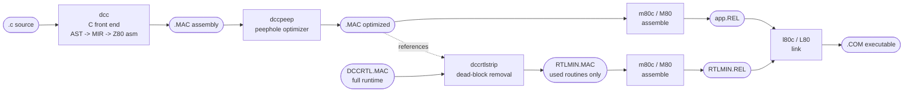
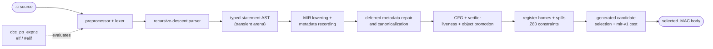
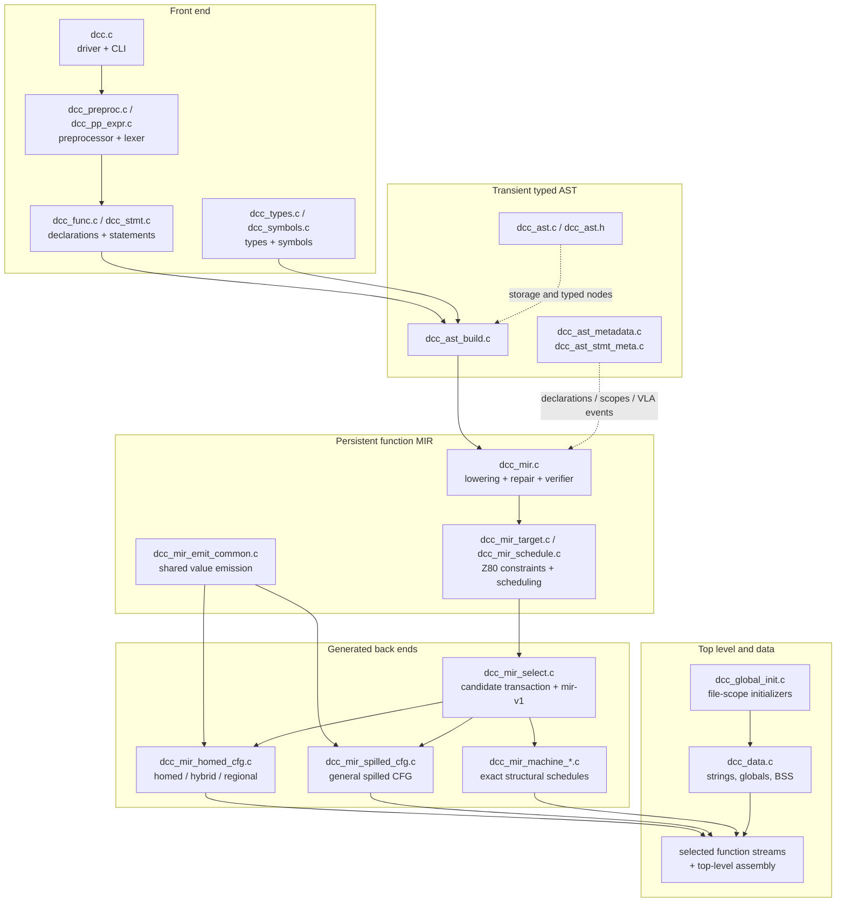
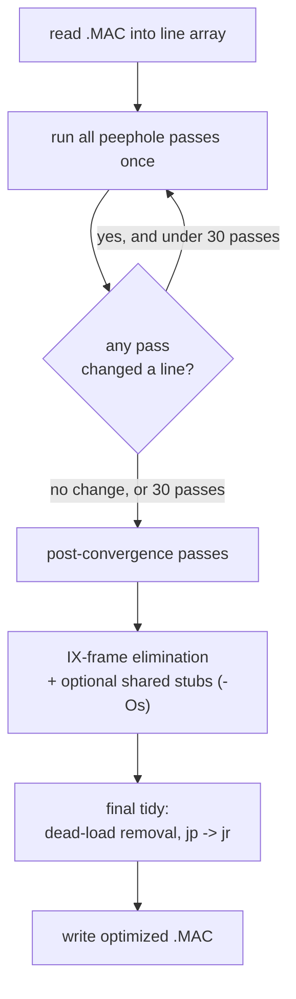
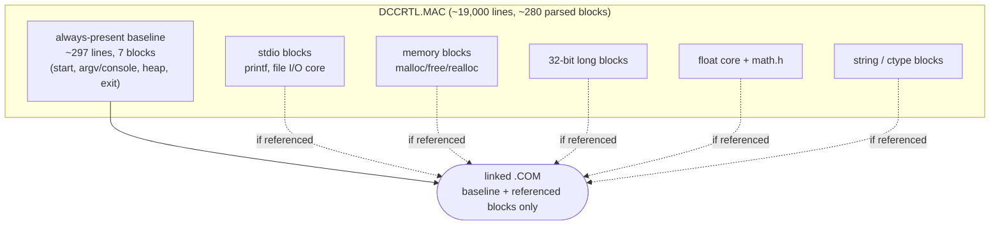

# Appendix: compiler architecture

This appendix describes the DCC C Compiler toolchain: the compiler `dcc`, the peephole
optimizer `dccpeep`, the runtime size reducer `dccrtlstrip`, and the assembler
and linker - either the host-native `m80c`/`l80c`, or the Microsoft `M80`/`L80`
originals running under `ntvcm`.

!!! note "Host-resident tools"
  `dcc`, `dccpeep`, `dccrtlstrip`, `m80c`, and `l80c` run on Windows, macOS,
  and Linux. They never run on a Z80. They emit Z80 assembly text and CP/M
  `.COM` files that run under CP/M-80, for example via the `ntvcm` emulator.
  `m80c`/`l80c` are clean-room, LINK-80-object-format-compatible
  reimplementations of `M80`/`L80` with unbounded host memory instead of
  CP/M's own 64K tables - large `nopeep` builds can exhaust real `L80`'s own
  in-emulator linking workspace well before the target program itself would
  not fit; `l80c` has no such ceiling. They are the default; pass
  `dcc-use-emulated-m80=true`/`dcc-use-emulated-l80=true` to `dccmake` (or
  `--emulated-m80`/`--emulated-l80` to `ma.sh`/`ma.ps1`) to use the real
  `M80.COM`/`L80.COM` under `ntvcm` instead, e.g. to cross-check output.

  The compiler implementation is portable C11 host code built by modern Clang,
  GCC, or MSVC. That implementation language is independent of `dcc`'s C89
  base language and selected C99/C11 additions for the 16-bit Z80 target.

## The toolchain at a glance

A single `.c` file becomes a CP/M `.COM` executable through a short pipeline.
Each stage has one job and hands a text or object file to the next:

| Stage | Tool | Input | Output | Role |
| --- | --- | --- | --- | --- |
| Compile | `dcc` | `.c` | `.MAC` | Parse typed AST, lower and verify MIR, then select Z80/M80 assembly |
| Optimize | `dccpeep` | `.MAC` | `.MAC` | Local peephole rewriting of the asm |
| Reduce runtime | `dccrtlstrip` | `DCCRTL.MAC` + app `.MAC` | `RTLMIN.MAC` | Keep only the runtime routines the app references |
| Assemble | `m80c` or `M80` | `.MAC` | `.REL` | Object code (relocatable); `dccmake` uses native `m80c` by default |
| Link | `l80c` or `L80` | `.REL` files | `.COM` | Resolve symbols into a CP/M executable; `dccmake` uses native `l80c` by default |

The `dccpeep` stage is optional (`./scripts/ma.ps1 name -Mode nopeep` skips it
when run from PowerShell in the DCC C Compiler checkout). `dccrtlstrip` runs against the
*final* application assembly so it
sees the real set of runtime symbols the program calls.

## Compiler shape: front end, AST, and MIR

DCC C Compiler is an **AST/MIR compiler**. The recursive-descent front end
builds typed AST nodes for function statements and expressions. Those transient
nodes lower into one persistent MIR function before the AST arena is reused.
Production function assembly is emitted from generated MIR candidates.

Top-level declarations, global initializers, strings, and data/BSS placement
remain table-driven because they are not function-body instructions.

| Classic phase | DCC C Compiler implementation |
| --- | --- |
| Preprocessing / lexical analysis | Integrated macro engine and `next_token` lexer in `dcc_preproc.c`; `dcc_pp_expr.c` evaluates conditional directives |
| Parsing | Recursive descent builds typed AST nodes against live symbol/type tables |
| Intermediate representation | Persistent per-function MIR with virtual values, typed memory, calls, labels, branches, PHIs, VLA operations, and aggregate copies |
| MIR analysis | Deferred metadata repair, CFG construction, verification, object promotion, liveness, target constraints, register homes, and spill-slot planning |
| Instruction selection | Exact machine schedules plus general homed, hybrid/regional, and spilled CFG candidates |
| Profitability | `mir-v1` compares generated candidates using machine instructions/bytes, helper/frame/spill costs, moves, branches, and loop weighting |
| Machine-dependent cleanup | Standalone `dccpeep` fixpoint optimization over the selected assembly |

### Transient AST, persistent MIR

AST nodes retain C result type and effective operand type, so integer
promotions, pointer scaling, long/float operations, bit-fields, and lvalue
widths are decided before lowering. The MIR keeps those decisions after the AST
arena is reset.

MIR uses virtual values rather than source-register claims. Its instruction
set represents constants, parameters, loads/stores, address/member/index
formation, unary/binary operations, call-site-tagged arguments and calls,
aggregate copies, labels, branches, jumps, edge-specific PHIs, returns, and VLA
stack save/allocate/restore operations.

### One production body walk

`dcc_func.c` performs one production metadata/MIR walk for each function.
Declarations are represented by stable placeholders because parser replay may
discover initializers, renamed C99 loop variables, strings, inline temporaries,
or VLA scope events after surrounding statements have already lowered.
`dcc_ast_metadata.c` and `dcc_ast_stmt_meta.c` fill and position those events
without generating a second assembly body.

This separation is load-bearing:

- declarations, scopes, VLA exits, labels, diagnostics, and debug events have
  explicit non-emitting owners;
- statement evaluation occurs once;
- initializer side effects cannot be duplicated by metadata replay;
- every production function body reaches instruction selection as verified MIR.

### Verification, promotion, and allocation

The verifier resolves labels, constructs instruction successors, rejects
undefined or multiply defined virtual values, and solves backwards liveness.
PHI operands are uses on their incoming CFG edges; call arguments remain live
through the matching call-site ID.

Conservative object promotion removes local/parameter loads only when every
reachable predecessor agrees on the value. Unknown aliases, volatile accesses,
opaque user assembly, calls, or ambiguous joins stop the proof.

Allocation assigns lifetime homes in HL, DE, BC, or callee-saved IY, with
deterministic spill slots when pressure or ABI constraints require them.
Call-crossing ordinary values may use only IY. Fixed Z80 operand/result
registers are boundary constraints, so the emitter inserts moves rather than
precoloring a value for its whole lifetime.

### Generated-only candidate selection

Every candidate writes to its own temporary stream. A declining selector cannot
leave partial text in the next candidate. Production then chooses among:

- exact `scheduled-machine-cfg` kernels with complete structural proofs;
- `homed-scalar-cfg`, including hybrid and regional-home variants;
- the general `spilled-scalar-cfg` emitter.

The `mir-v1` policy compares only generated MIR candidates.
`DCC_MIR_REQUIRE_COMPLETE=1` and `DCC_MIR_REQUIRE_EMIT=1` are the strict
semantic and generated-output boundaries.

Proofs are deliberately conservative. Unknown, recursive, cyclic, volatile,
aliased, or unsupported shapes decline an optimization, not MIR emission.

### Refactor validation

For behavior-preserving front-end or metadata refactors, compare raw compiler
output and diagnostics before and after, then run the CP/M suite. For MIR
selection changes, compare stack and no-stack census snapshots, run every app
whose generated hash or metrics changed in peep and nopeep modes, and finish
with strict full+extended stack and no-stack runs.

## Compiler Features

The DCC C Compiler is intentionally small, but the compiler front end still provides a
user-facing feature set around diagnostics, C89/C99 compatibility extensions,
target-model checks, and size-oriented dead-code elimination in the generated
program.

### Error messages by category

Compiler diagnostics are emitted through `dcc_diag_emit.c`. Each diagnostic is
assigned a stable `DCC-E####` code, reported with the source file and line, and
prints the original source line with a caret when the compiler has an exact
token position. The compile-fail diagnostic tests under `tests/diagnostics/`
lock these messages and carets against exact baselines.

| Category | Code range | Examples |
| --- | --- | --- |
| Name lookup | `DCC-E0201` | undeclared identifiers |
| Preprocessor and include handling | `DCC-E0301`-`DCC-E0321` | malformed `#include`, unknown directives, unmatched `#elif`/`#else`/`#endif`, bad macro arity |
| Constant expressions | `DCC-E0401`-`DCC-E0403` | non-constant expressions, division by zero, missing expression operands |
| Struct/union/enum/type semantics | `DCC-E0501`-`DCC-E0540` | field designators, `offsetof`, bit-fields, duplicate enum constants, missing type names, multiple storage classes |
| Array and pointer constraints | `DCC-E0601`-`DCC-E0605` | unsupported variable inner dimensions, invalid bounds/object sizes, scalar subscripting |
| Statement control flow | `DCC-E0701`-`DCC-E0706` | `break`/`continue` outside valid contexts, stray `case`/`default`, duplicate or undefined labels |
| Functions and declarations | `DCC-E0801`-`DCC-E0806` | parameter declaration errors, redefinitions, too few or too many function-call arguments |
| Initializers and assignment compatibility | `DCC-E0901`-`DCC-E0920` | invalid address initializers, non-constant initializers, string/array/struct initializer errors, integer-to-pointer assignment |
| Unsupported or malformed constructs | `DCC-E1001`-`DCC-E1005` | unsupported AST forms, malformed syntax, oversized string literals, unsupported `sizeof` expressions |
| General syntax and top-level parsing | `DCC-E1101`-`DCC-E1107` | expected tokens such as `;`, `)`, `]`, `=`, or an external declaration |
| CP/M/Z80 target-model limits | `DCC-E1201`-`DCC-E1203` | unsupported `double`, `long long`, and 64-bit integer typedef names |

The categories are deliberately broad: the numeric code says where the problem
was detected, while the message text names the exact source-level issue.

### Dead code detection and elimination

The DCC C Compiler does not run a whole-program control-flow analysis pass, and it does not
warn about arbitrary unreachable user statements. Instead, dead-code handling is
pragmatic and size-focused at the points where the toolchain has reliable local
knowledge:

- **Dead MIR values and stores.** Lowering records side effects separately from
  virtual results. Liveness, object promotion, and selector-local proofs can
  omit unused values, dead stores, and rematerializable temporaries.
- **Dead stores and labels in assembly.** `dccpeep` runs to a fixpoint over the
  emitted `.MAC` text. Among its cleanups are jump/label threading, jump-to-next
  removal, redundant load/store removal, and conservative dead IX-frame store
  elimination when a stack slot is overwritten before it can be read.
- **Dead static inline bodies.** Simple `static inline` functions can be
  buffered and emitted only when a real out-of-line body is needed, avoiding
  unused helper text in the generated assembly.
- **Dead runtime blocks.** `dccrtlstrip` performs conservative mark-and-sweep
  dead-block elimination over `DCCRTL.MAC`: it roots symbols referenced by the
  app, follows runtime-to-runtime references to a fixpoint, and writes
  `RTLMIN.MAC` containing only reachable runtime blocks.

This split keeps the compiler simple while still attacking the biggest sources
of wasted code: unused expression values, local assembly redundancies, unused
inline bodies, and unreferenced runtime support.

## Inside DCC C Compiler: module architecture

The compiler is one binary built from focused modules. Foundational target
types, shared data structures, and broadly used APIs live in `dcc.h`; narrower
contracts live in subsystem `*_internal.h` headers. Shared compiler state is
defined once in `dcc_state.c`; machine-family modules do not add shared data.

| Group | Modules | Responsibility |
| --- | --- | --- |
| Shared | `dcc.h`, `dcc_state.c`, subsystem `*_internal.h` files | Target model, shared contracts, and lifecycle-owned compiler state |
| Front end | `dcc.c`, `dcc_preproc.c`, `dcc_pp_expr.c`, `dcc_func.c`, `dcc_stmt.c`, `dcc_diag_emit.c` | Driver, preprocessing/lexing, declarations/statements, frame scan, and diagnostics |
| Types / symbols | `dcc_types.c`, `dcc_symbols.c`, `dcc_constexpr.c`, `dcc_fold.c` | Type system, symbol tables, constant-expression evaluation, constant folding |
| Typed AST / metadata | `dcc_ast.c`, `dcc_ast_build.c`, `dcc_ast_gen*.c`, `dcc_ast_metadata.c`, `dcc_ast_stmt_meta.c` | Transient typed trees, semantic classifiers, and non-emitting declaration/scope replay |
| Compatibility helpers | `dcc_expr.c`, `dcc_ops.c`, `dcc_cmp.c`, `dcc_assign.c`, `dcc_decl.c`, `dcc_stmt_fast.c`, `dcc_array_narrow.c` | Shared initializer/type behavior and conservative source proofs; not a production body emitter |
| MIR core | `dcc_mir.c`, `dcc_mir_emit_common.c`, `dcc_mir_target.c`, `dcc_mir_schedule.c` | Persistent IR, metadata repair, CFG/verifier, liveness, target constraints, common emission |
| MIR selection | `dcc_mir_select.c`, `dcc_mir_homed_cfg.c`, `dcc_mir_spilled_cfg.c` | Transactional generated candidates, homes/spills, and `mir-v1` selection |
| Machine schedules | `dcc_mir_machine_emit.c`, `dcc_mir_machine_*.c` | Exact structural matchers and specialized Z80 streams |
| Top level / output | `dcc_func.c`, `dcc_global_init.c`, `dcc_data.c` | Function/frame parsing, one production metadata/MIR body walk, global initializer recording, deferred static-body placement, and data-section emission |

### Exact machine-schedule families

`dcc_mir_machine_emit.c` owns common machine helpers and the order-sensitive
dispatch. Cohesive schedules live in separately compiled families:

| Family module | Responsibility |
| --- | --- |
| `dcc_mir_machine_attention.c` | Matrix, attention, and fixed-point kernels |
| `dcc_mir_machine_numeric.c` | Integer, long, fixed-point, and math kernels |
| `dcc_mir_machine_float_reports.c` | Float reports and checks |
| `dcc_mir_machine_scanners.c` | Scan, parse, and traversal loops |
| `dcc_mir_machine_aggregate_checks.c` | Aggregate, array, and struct checks |
| `dcc_mir_machine_runtime_runners.c` | Runtime, file, and system orchestration |
| `dcc_mir_machine_interpreter_runners.c` | Interpreter and parser runners |
| `dcc_mir_machine_call_runners.c` | Call/control orchestration |
| `dcc_mir_machine_validation_runners.c` | Scope, wide-value, and validation runners |
| `dcc_mir_machine_endgame.c` | Large final exact schedule families |

Machine families follow a zero-shared-state rule:

- plans, candidates, and mutable matching state are automatic and attempt-local;
- each family exports one dispatcher and no data;
- module-local constant tables use internal linkage;
- `dcc_mir_machine_internal.h` contains function contracts, not shared plan
  storage.

Run `scripts/audit-c-module-exports.py` after changing a module boundary. The
audit must report only the allowed dispatcher and no exported data.

## Inside dccpeep: a fixpoint peephole optimizer

`dccpeep` is DCC C Compiler's **machine-dependent optimizer**. It reads the emitted `.MAC`
as an array of text lines and applies dozens of small *peephole* rewrites —
each one matches a short local instruction pattern and replaces it with a
cheaper equivalent (for example folding a redundant store/reload, threading a
jump-to-jump, turning an `ld`/`cp` against zero into `or a`, or replacing an
absolute `jp` in range with a relative `jr`).

The optimizer is split by responsibility. `peep_lines.c` owns storage,
mutation, physical-line I/O, and opaque barriers for `; dcc user asm` regions;
passes never rewrite or delete those user-authored lines. `peep_parse.c`
contains stateless assembly parsers, `peep_effects.c` caches structured line,
opcode, register, and flag metadata, and `peep_analyze.c` contains shared
conservative register analysis. `peep_control_flow.c` owns versioned
label/function indexes and bounded reachability queries. The main `dccpeep.c`
file owns the descriptor-driven, order-sensitive fixed-point catalogue and
remaining general passes. `PeepContext` groups program ownership, options,
statistics, mutation versions, and cached indexes; compatibility globals
preserve established pass signatures. `PeepEditTransaction` provides opt-in
atomic commit/rollback for coupled rewrites.
The high-volume local dispatcher, board/game idioms, loop registerization, and
compiler-tagged temporary handling live in `peep_pass_once.c`,
`peep_pass_minmax.c`, `peep_pass_loops.c`, and
`peep_pass_inline_temp.c`. Label and branch rewrites live in
`peep_pass_control_flow.c`. Post-convergence shared-helper rewrites and
terminal cleanup live in `peep_pass_stubs.c` and `peep_pass_final.c`
respectively, behind `dccpeep_internal.h`.

dccpeep runs its rewrite catalogue to a **fixpoint** so one rewrite can expose
the pattern another rewrite needs:

Key design points:

- **Driven to convergence.** The main loop re-runs every pass until a full
  sweep makes no change (capped at 30 iterations), because passes feed each
  other — e.g. a store/reload elimination can create a dead label that a later
  pass then removes.
- **Order-sensitive post-passes.** A few transforms must run *after*
  convergence: the signed-compare constant-bias fold, IX-frame elimination,
  and the shared-stub passes all depend on the instruction stream having
  settled, because earlier structural passes recognise loops by their
  canonical (un-folded) shape.
- **Two optimization goals.** `-Ot` (default, "time") inlines helper sequences
  for speed; `-Os` ("size") factors recurring sequences into shared `call`
  stubs to shrink the binary. Each helper family counts complete matches first
  and fires only at its whole-program linked-stub break-even. The mode is
  chosen on the command line and changes which post-convergence passes fire.
- **Text safety is explicit.** Physical input lines are read without a fixed
  length limit. Marked user-assembly regions become opaque label barriers while
  optimization runs, then are restored byte-for-byte; address relaxation also
  refuses to estimate across them.
- **Direct observability.** `scripts/run-dccpeep-tests.ps1` checks focused
  default, `-Os`, and undocumented-opcode fixtures plus idempotence. Optional
  `-fstats` output reports convergence iterations, per-pass calls and changes,
  and inserted/deleted line totals to stderr without changing normal output.

!!! tip "Why a separate program instead of an in-compiler pass"
    Keeping the peephole optimizer as a standalone text-to-text filter keeps
    the compiler simple and allows inspection, diffing, and skipping
    optimization (`nopeep`). The assembly is the contract between the two tools.

## The runtime: a block-structured library sized for stripping

The runtime `DCCRTL.MAC` is a single ~19,000-line assembly source, but its
*architecture* is what makes the toolchain's "pay only for what you use"
property possible. Rather than one monolithic blob, the runtime is written as
**~280 parsed blocks** around `public` entry points and shared preludes. A
program never links the whole library — `dccrtlstrip` keeps only the blocks the
application actually references (the mark-and-sweep details are in the companion
appendix [*Runtime optimization*](01-dccrtlstrip.md)). The architectural
consequence is that **every routine has a well-defined, measurable size cost**.

### Two numbers describe every routine

Because the runtime is block-structured, each public routine has two costs that
the build-time size hook (`docs/docs/hooks/runtime_sizes.py`) measures directly:

- **self** — the source lines in the routine's own block.
- **marginal** — self *plus* every additional block it transitively links
  beyond the always-present baseline. This is the real incremental cost of
  using a routine in a program that otherwise wouldn't need it.

The gap between the two is the whole story of the runtime's size architecture: a
small `self` with a large `marginal` means the routine sits on top of a big
shared substrate (the file-I/O core, or the float arithmetic core).

### The always-present baseline (~297 lines)

Seven blocks are always linked because they are reachable from the forced
`start` root: program entry and heap/BSS setup, the command-tail `argv` builder
(which also contains the console writer `__conout`), the heap-state words, and
`exit`. Console output therefore costs essentially nothing extra — `putchar`
and `puts` call into code that is already present.

### What the feature groups cost

The runtime's size is dominated by a few shared cores. Routines that sit on a
core are cheap individually but expensive to introduce, because the first one
links the whole core:

| Feature group | Shared core it tends to link |
| --- | --- |
| Console output (`putchar`, `puts`, integer `printf`) | baseline console writer or self-contained formatter |
| File-stream + low-level I/O (`fopen`, `fread`, `fputs`, `fprintf`) | FCB/DMA file core |
| `scanf` / `sscanf` / `fscanf` | shared scan core |
| Memory (`malloc`/`free`/`realloc`/`calloc`) | heap helpers and size arithmetic |
| 32-bit `long` arithmetic | long multiply/divide/modulo helpers |
| `float` operators | float normalise/round core |
| `math.h` (`sinf`, `expf`, `powf`, …) | float core plus conversions and chained math helpers |
| `string.h` / `ctype.h` | usually self-contained routines |

The exact per-routine `self`/`marginal` numbers — and the transitive
dependencies behind each one — are tabulated on the auto-generated
[*Runtime function sizes*](02-runtime-sizes.md) page, with the optimisation
takeaways in [*Runtime optimization*](01-dccrtlstrip.md). The takeaways for
sizing a program are:

- **Console-only output and string/ctype routines are cheap** — they link
  little or nothing beyond the baseline.
- **The first file, `scanf`, or `float` operation is the expensive one**; it
  links a shared core. Additional routines in the same family are then nearly
  free.
- **`math.h` is the single biggest lever** — the `exp`/`log`/`pow` and
  hyperbolic group are expensive because each chains other math routines on top
  of the float core.

Those numbers are recomputed from `DCCRTL.MAC` on every docs build, so editing
the runtime and rebuilding the docs is all that is needed to refresh them.

## Architecture summary

- DCC C Compiler is an **AST/MIR** C89-base compiler with selected C99/C11
  additions. Typed AST nodes lower into persistent verified function MIR.
- MIR owns CFG, PHIs, virtual values, object promotion, liveness, register
  homes, spills, target constraints, and generated candidate selection.
- Production function assembly comes only from MIR.
- Exact machine families and general homed/spilled CFG emitters compete under
  the generated-only `mir-v1` cost policy.
- Machine-dependent optimization is split out into **`dccpeep`**, a
  fixpoint peephole optimizer over the assembly text, with separate time (`-Ot`)
  and size (`-Os`) strategies.
- The runtime `DCCRTL.MAC` is **block-structured** (~280 parsed blocks over a
  ~297-line baseline), so every routine has a measurable
  `self`/`marginal` size cost and `dccrtlstrip` can link only the blocks a
  program references.
- The back half of the pipeline uses native **`m80c`**/**`l80c`** (or
  Microsoft **`M80`**/**`L80`** under `ntvcm`) for assembly and linking - a
  shared LINK-80-compatible `.REL` object format that DCC C Compiler consumes
  as a fixed target rather than needing to invent its own.
