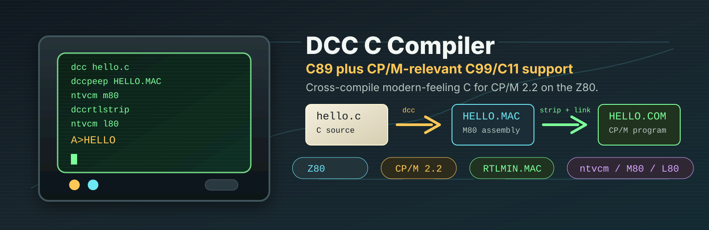

# Introduction

**dcc** is an open source C compiler for **CP/M 2.2 on the Z80**. It has a C89
core plus target-appropriate C99/C11 front-end compatibility. For every source
file it accepts, dcc translates the `.c` file to M80 assembly; M80 assembles the
result, and L80 links it into a CP/M `.COM` program.

dcc runs on Windows, macOS, and Linux, but the programs it builds run under
CP/M. The [ntvcm](https://github.com/davidly/ntvcm) emulator and other popular
CP/M Z80 emulators run those programs.

The repository contains tests and build scripts, but dcc is not tied to the
repository. Once the tools are on your `PATH`, you can build CP/M programs from
any project directory.

This manual describes the language accepted by dcc, the runtime library, and the
build path from C source to `.COM` file.

- Start with [Setting up the toolchain](00-setup-toolchain.md).
- See [Building and linking](02-build-and-link.md) for the normal build flow.
- See [C conformance and target exceptions](01-c-conformance.md),
  [Types and conventions](03-types-and-conventions.md), and
  [Operators](04-operators.md) for the language rules.
- Use the library reference for [assert.h](standard-lib/01-assert.md),
  [ctype.h](standard-lib/07-ctype.md), [errno.h](standard-lib/02-errno.md),
  [float.h](standard-lib/03-float.md), [limits.h](standard-lib/04-limits.md),
  [math.h](standard-lib/08-math.md), [setjmp.h](standard-lib/09-setjmp.md),
  [stdarg.h](standard-lib/10-stdarg.md), [stdbool.h](standard-lib/11-stdbool.md),
  [stddef.h](standard-lib/12-stddef.md), [stdint.h](standard-lib/13-stdint.md),
  [stdio.h](standard-lib/05-stdio.md), [stdlib.h](standard-lib/06-stdlib.md),
  [string.h](standard-lib/14-string.md), and
  [system / CP/M services](10-system-and-cpm.md).
- Read [Limitations](11-limitations.md) before depending on hosted-C behavior.
- Try the [worked examples](12-examples.md) when you want complete programs.
- Use [Agentic skills](00-agent-skills.md) if you want an AI assistant to load the
  dcc-specific rules while working in another project.

## Runtime

`DCCRTL.MAC` is the runtime. It is Z80 assembly in M80/L80 syntax. It supplies:

- the `start` entry point, which sets up the heap and calls `main`,
- command-line parsing for `argc` and `argv`,
- the supported C library routines,
- integer and floating-point helpers used by generated code.

Normal builds trim the runtime before linking. Unused routines are left out of
the final `.COM` file. The build steps are shown in
[Building and linking](02-build-and-link.md); the trimming details are in the
[`dccrtlstrip` appendix](appendix/01-dccrtlstrip.md).

!!! note "Single source of truth"
    Functions that are declared in the standard headers but are **not** part of
    the linked runtime are called out explicitly in
    [Limitations](11-limitations.md) so a missing function never surprises you
    at link time.

## Performance Snapshot

The chart compares `.COM` programs produced by dcc with CP/M-era and modern
CP/M-targeting compilers. Times come from `ntvcm -p` cycle counts converted to
the emulator's `approx ms at 4Mhz` value for Z80-mode runs. Sizes are CP/M file
sizes rounded to 128-byte records. Lower is better for `ms` and `bytes`.

The benchmark names are the test programs: strings and memory (`tstring`),
sieve, digits of `e`, allocation (`tm`), tic-tac-toe (`ttt`), hexadecimal pi
digits (`pihex`), and matrix multiply (`mm`). Rows labelled `xcomp` are dcc
output before `dccpeep`; rows labelled `dccpeep optimized` are after the
optimizer pass.

## Engineering Notes

The dcc C Compiler was engineered agentically, with plenty of human supervision,
patience, and love. It is unit tested against baselines grounded in modern desktop
C compilers and a platform-appropriate subset of the community-driven
[c-testsuite](https://github.com/c-testsuite/c-testsuite).

## Contributions and Feedback Welcome

This is an Open Source C compiler, community contributions welcome and/or report issues via the GitHub Issues for this project.

