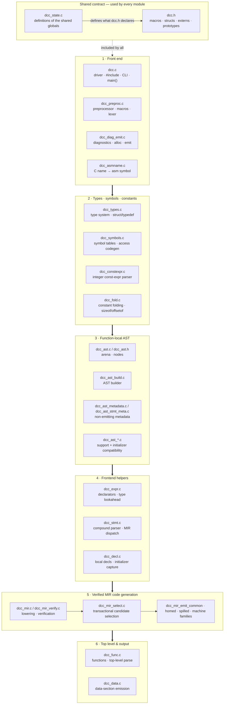

# dcc — modularised compiler source

`dcc` is a compact C compiler with a C89 base language plus selected C99 and
C11 features that fit the CP/M/Z80 target. It emits Z80 assembly for the
M80-compatible CP/M toolchain. The compiler implementation is portable C11 host
code built with modern Clang, GCC, or MSVC. This directory holds the
**modularised** form of the compiler: the original ~18.8k-line single file was
split into focused, separately compiled modules — one `.c` per subsystem plus a
shared umbrella header — so that both human and agentic developers can navigate
and modify one subsystem at a time.

> The historical monolithic compiler is available in Git history, not the
> maintained source tree. It is not a code-generation oracle.

---

## How the modular build is structured

`dcc` now lowers function bodies through a **function-local AST**. The parser
builds typed statement/expression trees, captures their semantics into verified
MIR, and emits Z80 only from a selected generated MIR candidate. Subsequent AST
walks preserve frontend metadata without emitting body instructions. The
compiler shares foundational types/state through `dcc.h`; focused AST, MIR,
and preprocessor contracts use internal headers.

Frontend names describe ownership: AST modules classify, check support, or
capture semantics; `parse_*` consumes syntax, `capture_*` records MIR when
active, and `record_*` tracks metadata/linkage. `emit_*` is reserved for actual
output, such as deferred EXTRNs and generated MIR candidate instructions.

- [`dcc.h`](dcc.h) is the umbrella header. It declares everything shared:
  capacity macros, the type/storage/token constants, the core record types
  (`Token`, `Sym`, `Def`, `AsmName`, `TypeDef`, `FieldDef`, `StructDef`,
  `ConstVal`, `ByteOperand`), `extern` declarations for the shared globals, and
  the prototypes for every cross-module function (grouped by owning module).
- Each subsystem is a normal `.c` translation unit that starts with
  `#include "dcc.h"`. They are compiled separately and linked together.
- [`dcc_state.c`](dcc_state.c) **defines** the shared globals once; every other
  module reaches them through the `extern` declarations in [`dcc.h`](dcc.h).
- [`dcc.c`](dcc.c) is the driver translation unit and contains `main()`.

The current compiler intentionally differs from the historical snapshot.
Behavior-preserving refactors compare against the current generated-only
compiler. Checked program-output and performance baselines live under
[`../../tests/`](../../tests/).

### Why there is one shared header instead of many

The parser and code generator genuinely share most of their data: the source
buffer, the lookahead token, the symbol/typedef/struct tables, and a set of
per-function codegen flags. Splitting those into per-module headers would just
produce a web of headers that all include each other. A single umbrella header
keeps the shared contract in one place and the modules free of cross-include
ordering puzzles.

### State ownership

Most mutable state is shared and therefore defined in [`dcc_state.c`](dcc_state.c)
and declared `extern` in [`dcc.h`](dcc.h). A small amount of state is private to
a single module and kept `static` there:

- `pp_expr_p` / `pp_expr_depth` → [`dcc_pp_expr.c`](dcc_pp_expr.c) (the `#if`
  expression cursor)
- `include_dirs` / `num_include_dirs` → [`dcc.c`](dcc.c) (the include search
  path)

### Function-local AST and MIR lowering

[`dcc_ast_build.c`](dcc_ast_build.c) parses function statements into
[`dcc_ast.h`](dcc_ast.h) nodes. MIR lowers each supported statement directly.
[`dcc_ast_metadata.c`](dcc_ast_metadata.c) and
[`dcc_ast_stmt_meta.c`](dcc_ast_stmt_meta.c) replay only parser metadata:
declarations/initializers, scopes and VLA exits, inline-temp types, string-pool
order, labels, diagnostics, and debug events. No AST function-body Z80 emitter
or discard stream remains.

Two stderr-only debugging knobs are available: `DCC_AST_REPORT=1` logs the
`; AST-unsupported ...` statement/initializer that a support gate declined (it
prints just before the `unsupported AST statement` fatal), and `DCC_AST_DUMP=1`
dumps each built AST tree before it is lowered. Neither affects codegen.

AST construction and verified MIR emission are unconditional. The retired
`DCC_AST_BUILD`, `DCC_MIR_CANDIDATES`, and `DCC_MIR_GENERAL_CANDIDATES` controls
are no longer read; use `DCC_AST_DUMP` for AST dumps and `DCC_MIR_REPORT` for
MIR dumps. Active selector-isolation, cost-policy, cache-verification, and
mutation controls remain available for backend diagnosis and proof campaigns.
`DCC_MIR_REQUIRE_COMPLETE` and `DCC_MIR_REQUIRE_EMIT` retain their stricter
failure diagnostics; they are not required to enable the production pipeline.

Local declarations remain captured lexer spans, but explicit scan/replay APIs
now own their frame and initializer side effects. Production function assembly
comes only from a selected generated MIR candidate.

[`dcc_mir_verify.c`](dcc_mir_verify.c) independently checks reachable value,
PHI-edge, and call-argument dominance after promotion and before allocation.
See [host verifier tests](../../tests/host/README.md) for the regression gate.

---

## Module architecture


```mermaid
graph TB
    subgraph SHARED["Shared contract — used by every module"]
        H["dcc.h<br/>macros · structs · externs · prototypes"]
        STATE["dcc_state.c<br/>definitions of the shared globals"]
        STATE -->|defines what dcc.h declares| H
    end

    subgraph FE["1 · Front end"]
        DRV["dcc.c<br/>driver · #include · CLI · main()"]
        PP["dcc_preproc.c<br/>preprocessor · macros · lexer"]
        DIAG["dcc_diag_emit.c<br/>diagnostics · alloc · emit"]
        ASM["dcc_asmname.c<br/>C name → asm symbol"]
    end

    subgraph TYP["2 · Types · symbols · constants"]
        TYPES["dcc_types.c<br/>type system · struct/typedef"]
        SYM["dcc_symbols.c<br/>symbol tables · access codegen"]
        CONST["dcc_constexpr.c<br/>integer const-expr parser"]
        FOLD["dcc_fold.c<br/>constant folding · sizeof/offsetof"]
    end

      subgraph AST["3 · Function-local AST"]
        ASTN["dcc_ast.c / dcc_ast.h<br/>arena · nodes"]
        ASTB["dcc_ast_build.c<br/>AST builder"]
        ASTM["dcc_ast_metadata.c / dcc_ast_stmt_meta.c<br/>non-emitting metadata"]
        ASTG["dcc_ast_*.c<br/>support + initializer compatibility"]
      end

      subgraph FRONT["4 · Frontend helpers"]
        EXPR["dcc_expr.c<br/>declarators · type lookahead"]
        STMT["dcc_stmt.c<br/>compound parser · MIR dispatch"]
        DECL["dcc_decl.c<br/>local decls · initializer capture"]
    end

    subgraph MIR["5 · Verified MIR code generation"]
        LOWER["dcc_mir.c / dcc_mir_verify.c<br/>lowering · verification"]
        SELECT["dcc_mir_select.c<br/>transactional candidate selection"]
        EMITTERS["dcc_mir_emit_common · homed · spilled · machine families"]
        LOWER --> SELECT --> EMITTERS
    end

    subgraph TOP["6 · Top level & output"]
        FUNC["dcc_func.c<br/>functions · top-level parse"]
        DATA["dcc_data.c<br/>data-section emission"]
    end

    SHARED -. included by all .-> FE
    FE ==> TYP ==> AST ==> FRONT ==> MIR ==> TOP
```

*Reading the diagram:* the **Shared contract** (top) is `#include`d by every
module. The thick arrows are the dominant translation pipeline — front end →
types/symbols → AST/MIR capture → generated emission → output. Within a stage the files
are peers; the per-file call relationships are summarised in the runtime flow
below.

### Compilation pipeline (runtime flow)


```mermaid
flowchart LR
    SRC([".c source"]) --> DRV["dcc.c<br/>read + #include splice"]
    DRV --> PPF["dcc_preproc.c<br/>#if filter + macro expand"]
    PPF --> LEX["dcc_preproc.c<br/>next_token · lexer"]
    LEX --> PARSE["dcc_func · dcc_stmt<br/>parse function bodies"]
    PARSE --> AST["dcc_ast_build.c<br/>build function-local AST"]
    AST --> MIR["dcc_mir.c / dcc_mir_verify.c<br/>lower · verify"]
    MIR --> EMIT["dcc_mir_select.c<br/>select generated Z80"]
    EMIT --> DATA["dcc_data.c<br/>emit data section"]
    DATA --> OUT([".mac assembly"])
```

Calls flow roughly front-to-back, but because every module shares `dcc.h` any
module may call any other module's functions (the prototypes are all visible).
The arrows above show the dominant direction, not a hard layering restriction.

---

## The modules

| File | Responsibility |
| --- | --- |
| [`dcc.h`](dcc.h) | Umbrella header included by every module: capacity macros (`MAX_*`), type/storage/token constants (`TYPE_*`, `SC_*`, `TOK_*`), the nine core record types, `extern` declarations of the shared globals, and grouped prototypes for every cross-module function. |
| [`dcc_state.c`](dcc_state.c) | Definitions of the shared globals declared `extern` in `dcc.h`: source buffer + lexer position + lookahead token, symbol/typedef/struct/field tables, the macro table, the `#if` stack, the string pool, per-function codegen flags, and parser scratch state. |
| [`dcc_asmname.c`](dcc_asmname.c) | Maps each C identifier to its emitted M80 assembler symbol: when to mangle (M80's 6-significant-character publics, reserved words), recognises fixed runtime-library entry points, and caches results in `asm_names[]`. |
| [`dcc_diag_emit.c`](dcc_diag_emit.c) | Plumbing: `fatal`/`error_here` diagnostics, `source_location_at` (`#line`-aware), `xmalloc`, label allocation, top-level assembly-output plumbing, and the raw source readers `peekc`/`getc_src`. |
| [`dcc_preproc.c`](dcc_preproc.c) | Preprocessor + lexer: `#define`/`#undef`/`#if`/`#ifdef`, object- and function-like macro expansion (`#` stringize, `##` paste), the `#if` constant-expression evaluator, and the main tokenizer `next_token`. |
| [`dcc_types.c`](dcc_types.c) | Type system: base-type and declarator parsing, struct/union and typedef tables, bitfield layout, type sizing/promotion/arithmetic helpers, and enum-constant lookup. |
| [`dcc_constexpr.c`](dcc_constexpr.c) | Context-specific wrappers around typed `ConstVal` evaluation and C11 `_Static_assert` declaration parsing. |
| [`dcc_symbols.c`](dcc_symbols.c) | Symbol tables, string pool, scope/VLA metadata, layout predicates, sizeof/offsetof parsing, and deferred EXTRN bookkeeping. No symbol load/store body emitter remains. |
| [`dcc_fold.c`](dcc_fold.c) | The `cf_*` typed constant-folding engine; records values rather than emitting instructions. |
| [`dcc_ast.h`](dcc_ast.h), [`dcc_ast.c`](dcc_ast.c) | Function-local AST node definitions, list helpers, arena allocation, and debug dumping. |
| [`dcc_ast_build.c`](dcc_ast_build.c) | AST builder for expressions and statements, including declaration-span capture for local declarations. |
| [`dcc_ast_classify.c`](dcc_ast_classify.c), [`dcc_ast_support.c`](dcc_ast_support.c), [`dcc_ast_capture.c`](dcc_ast_capture.c), [`dcc_ast_stmt_classify.c`](dcc_ast_stmt_classify.c), [`dcc_ast_internal.h`](dcc_ast_internal.h) | Shared AST type/support classifiers and local-initializer compatibility helpers. Function-body statement emission has been removed. |
| [`dcc_ast_metadata.c`](dcc_ast_metadata.c), [`dcc_ast_stmt_meta.c`](dcc_ast_stmt_meta.c) | Non-emitting declaration, scope/VLA, inline, string, label, diagnostic, debug, and frame-sizing metadata walks. |
| [`dcc_expr.c`](dcc_expr.c) | Declarator/sizeof parsing, initializer-shape counting, user labels, callable/aggregate queries, and type lookahead. |
| [`dcc_decl.c`](dcc_decl.c) | Local declaration parsing, constant folding, and scalar/array/aggregate/bitfield/VLA initializer MIR capture; no non-MIR instruction fallback. |
| [`dcc_stmt.c`](dcc_stmt.c) | Compound-block parser and statement-to-MIR/metadata dispatcher. |
| [`dcc_func.c`](dcc_func.c) | Function and top-level declaration parsing, frame sizing, MIR lifecycle, typedef declarations, and file-scope object parsing/emission. |
| [`dcc_mir.c`](dcc_mir.c), [`dcc_mir_verify.c`](dcc_mir_verify.c) | Function lowering, metadata repair, CFG/dataflow/allocation, and independent dominance verification. |
| [`dcc_mir_select.c`](dcc_mir_select.c), `dcc_mir_emit_common.c`, `dcc_mir_homed_cfg.c`, `dcc_mir_spilled_cfg.c`, `dcc_mir_machine_*.c` | Transactional selection and generated Z80 candidates; the only production function-body emitters. |
| [`dcc_data.c`](dcc_data.c) | Data-section emission: the string-literal pool and global object storage with initializers, rendered as `DEFB`/`DEFW`. |
| [`dcc.c`](dcc.c) | Driver and entry point: input file I/O, `#include` resolution and line-directive splicing, the active-source filtering pass, command-line option parsing, and `main()`. |

---

## Building

From the repository root:

```powershell
pwsh ./scripts/build-dcc.ps1
```

The canonical cross-platform build compiles every compiler module (`dcc.c`,
`dcc_state.c`, and the `dcc_*.c` files) as portable C11 and links `./dcc` at
the repository root. It also builds the companion host tools, debugger host,
and example debugger I/O adapter.

> Note: linking may print `ld: warning: reducing alignment of section
> __DATA,__common ...`. That is benign — it reflects the compiler's large
> static tables and does not affect correctness.

---

## Verifying

For one application, use the normal toolchain and its fixture-aware runner:

```sh
./dccmake tests/tlong.c dcc-output=TLONG dcc-peep=true
pwsh ./scripts/runall.ps1 -Apps tlong -Mode full -RunTimeout 30
```

Run both strict full+extended release gates (requires `ntvcm` on `PATH`):

```sh
DCC_MIR_REQUIRE_COMPLETE=1 DCC_MIR_REQUIRE_EMIT=1 \
  pwsh ./scripts/runall.ps1 -Mode full -Extended -RunTimeout 30 -FailuresOnly
DCC_MIR_REQUIRE_COMPLETE=1 DCC_MIR_REQUIRE_EMIT=1 \
  pwsh ./scripts/runall.ps1 -Mode full -Extended -NoStackCheck \
  -RunTimeout 30 -FailuresOnly
```

`-Mode full` covers peep and nopeep. Per-app stdout baselines, execution
overrides, and checked cycle/size baselines are in `tests/baselines/`,
`tests/_test_overrides.json`, and `tests/perf_baselines.csv`. Do not move
baselines to hide regressions. POSIX users can use the equivalent
`python3 scripts/runall.py --mode full --extended` interface.

For pure refactors, compare complete application/function inventories, raw
assembly, diagnostics, and debug metadata against the current compiler.
Selector census hashes alone do not cover top-level assembly/data. The
documented `tstdc` embedded `__TIME__` difference is not an instruction change.
See [host tests](../../tests/host/README.md) for MIR/sanitizer checks and
[architecture](../../docs/docs/en/appendix/00-architecture.md) for the full
module map.

---

## Working in this codebase

- **Add or change behaviour** inside the relevant `dcc_*.c` module. Keep the
  change in the module that owns that responsibility.
- **Adding a new function that other modules call?** Define it in its module
  and add a prototype to the matching group in [`dcc.h`](dcc.h). Functions used
  only within one module can stay `static` and need no prototype in `dcc.h`.
- **Need a new shared constant or record type?** Add it to [`dcc.h`](dcc.h).
- **Need new shared state across modules?** Define it in [`dcc_state.c`](dcc_state.c)
  and add an `extern` declaration to [`dcc.h`](dcc.h). If it is used by only one
  module, prefer a `static` at the top of that module instead.
- **After any change**, rebuild and run the regression suite. For pure
  refactors, investigate every raw-output difference.
- **Reaching for an operand's type before it is lowered?** Carry it on the
  AST node and lower through MIR/shared AST support. Avoid
  adding new shallow source-text peeks; the AST is the source of truth for typed
  expressions.
